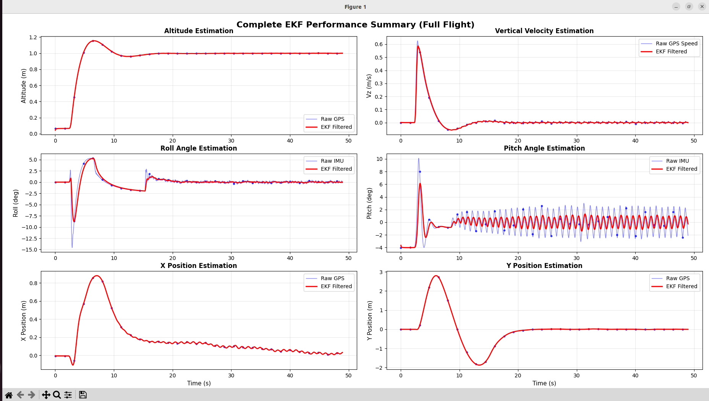

# Estimation_module_webots


*Figure 1: Post-flight performance analysis showing the EKF state estimation (Red) vs. Noisy Sensor Data (Blue).*

## 🌟 Key Features

* **Custom Sensor Fusion:** Implements a 9-state Kalman Filter from scratch to fuse high-frequency IMU data (1000Hz) with noisy, lower-frequency GPS inputs.
* **Synthetic Noise Injection:** Since Webots sensors are "perfect" by default, Gaussian noise is manually injected into the raw measurements before they reach the EKF. This forces the filter to actually perform estimation rather than just reading ground truth.
* **Cascaded Control Architecture:** A robust hierarchical control loop (Position → Velocity → Attitude → Rate) designed for stable hovering.
* **Post-Flight Analysis:** Automatically generates a performance plot (`result.png`) after the simulation concludes.

---

## 🎮 Control Architecture

The drone is stabilized using a hierarchical controller adapted from **[Webots_cascaded_pid](https://github.com/ani26052007/Webots_cascaded_pid)**.

1. **Position Controller (Outer Loop):** Computes target velocity to minimize position error.
2. **Velocity Controller:** Computes target acceleration (tilt angle).
   * *Frame Rotation:* Transforms world-frame velocity commands into the body-frame based on the drone's current Yaw.
3. **Attitude Controller:** Computes target rotation rates to achieve the desired tilt.
4. **Rate Controller (Inner Loop):** Computes motor mixing commands.

---

## 🧠 State Estimation (The Kalman Filter)

The `DroneEKF` class uses a probabilistic model to estimate the state vector **x**:

**x** = [φ, θ, ψ̇, z, vz, x, y, vx, vy]ᵀ

* **Prediction:** Constant velocity kinematic model.
* **Correction:** Fuses IMU (Roll, Pitch, Yaw Rate) and GPS (Position).
* **Pseudo-Velocity:** The filter calculates velocity from GPS position changes (v ≈ Δpos/Δt) to correct velocity states and prevent drift.

---

## ⚠️ Known Issues

### ❗ Y-Axis Overshoot
There is a known stability issue in the lateral control loops:
* **Symptom:** The drone exhibits a massive overshoot in the Y-direction when attempting to stabilize at the hover point.
* **Status:** Requires retuning of the Kp and Kd terms in the Y-axis controllers.

---

## 🛠️ Installation & Build

### Prerequisites
* **Webots:** R2023b or newer.
* **Python:** 3.8 or newer.

### Dependencies
Install the required Python libraries:
```bash
pip install numpy matplotlib
```

---

## 🚀 Usage (Run Instructions)

### 1. Project Structure

Ensure your directory looks like this:
```
.
├── controllers
│   └── ekf_with_cascaded_pid
│       └── ekf_with_cascaded_pid.py  <-- Main Controller
├── result.png                        <-- Output Plot
└── worlds
    └── my_world.wbt                  <-- Simulation World
```

### 2. Open the Simulation

* Launch Webots.
* Open the world file: **File → Open World... → Navigate to `worlds/my_world.wbt`**.

### 3. Run the Controller

You can run the controller in two ways:

#### Method A: Native Webots (Recommended)

1. In the Webots Scene Tree (left panel), find the **Drone** robot node.
2. Set the `controller` field to: `ekf_with_cascaded_pid`.
3. Press the **Play** button in the Webots toolbar.

#### Method B: External Controller (For Debugging)

1. In the Webots Scene Tree, set the drone's `controller` field to `<extern>`.
2. Run the simulation (it will wait for a connection).
3. From your terminal, run the script manually:
```bash
# Navigate to the controller directory
cd controllers/ekf_with_cascaded_pid/

# Run the script (ensure WEBOTS_HOME is set in your environment variables)
python ekf_with_cascaded_pid.py
```

### 4. Viewing Results

* The simulation is set to hover at altitude **1.0m**.
* Once the simulation stops (or you stop the script), the code will generate and save `result.png` in the root directory.

---

## 📊 Performance

The generated `result.png` plot shows:
* **Red Line:** EKF-estimated states (smooth, filtered output)
* **Blue Dots:** Raw noisy sensor measurements
* **Comparison:** Demonstrates the filter's ability to reduce noise and provide stable state estimates

---

## 🔧 Future Improvements

* Fine-tune Y-axis PID gains to eliminate overshoot
* Implement Extended Kalman Filter (EKF) for nonlinear dynamics
* Add waypoint navigation capabilities
* Integrate obstacle avoidance algorithms

---

* Control architecture adapted from [Webots_cascaded_pid](https://github.com/ani26052007/Webots_cascaded_pid)
* [Documentation](https://drive.google.com/file/d/1iAso1Id1bpChqfin3BA1C4pdKz59OGWF/view?usp=sharing)
